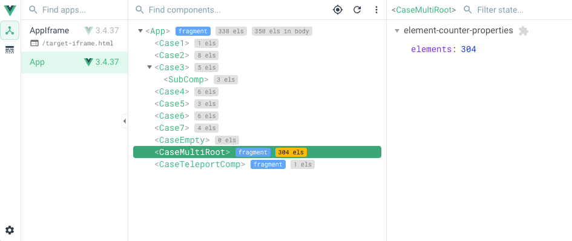
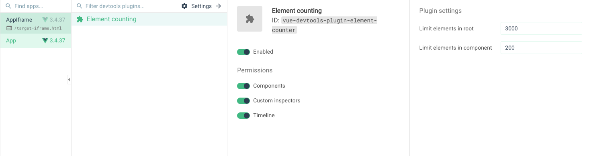
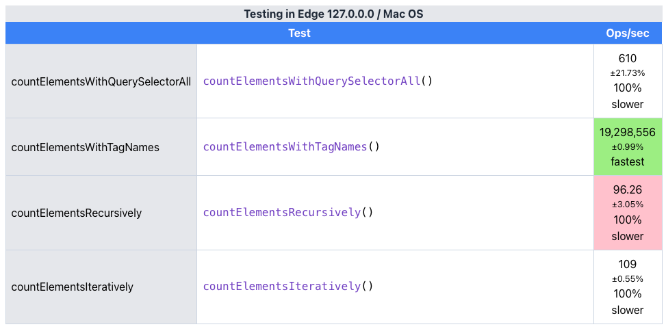

<h1 align="center">vue-devtools-plugin-element-counter</h1>

<p align="center">
<a href="https://github.com/hangboss/vue-devtools-plugin-element-counter/actions/workflows/test.yaml" target="__blank"></a>
</p>

A Vue Devtools plugin that counts and displays how many element nodes are rendered in a Vue component, helping you discover unnecessary element rendering or excessive element rendering that leads to performance issues.



## How to Use

> Only support in Vue Devtools 6+, and used vue-demi to support Vue2 and Vue3.

Install dependencies:

```bash
npm install vue-devtools-plugin-element-counter
```

To use in Vite/Webpack projects, it takes effect by default only in the development environment. If you need to enable it in the production environment, refer to:<https://vuejs.org/api/compile-time-flags.html#configuration-guides>, and set`__VUE_PROD_DEVTOOLS__: 'true'`

To use in Vue3:

```ts
import { createApp } from 'vue'
import type { ObjectPlugin } from 'vue'
import ElementCounterVue3 from 'vue-devtools-plugin-element-counter'
import './style.css'
import App from './App.vue'

const app = createApp(App)
app.use(ElementCounterVue3 as ObjectPlugin)
app.mount('#app')
```

To use in Vue2:

```ts
import Vue from 'vue'
import type { PluginObject } from 'vue'
import App from './App.vue'
import ElementCounterVue2 from 'vue-devtools-plugin-element-counter'

Vue.use(ElementCounterVue2 as PluginObject<never>)
new Vue({
  render: h => h(App),
}).$mount('#app')
```

The label in the Component Tree does not update in real-time. When your component changes, you can click force refresh in the devtools to refresh the entire Component Tree, or click the corresponding component in the Components Tree and check the current accurate element count in the state panel on the right.

## Settings



When the set limit is reached, the label will be highlighted.

## Performance

Tested under scenarios with 100 component nesting depths and 10,000+ element nodes rendered simultaneously, the additional performance overhead brought by the plugin in Devtools is negligible.

### For more details about the performance

After comparing various methods for counting elements, we found that `getElementsByTagName` has the best performance. Therefore, except for necessary traversals, all calculations use `getElementsByTagName`.

- `getElementsByTagName` returns a [live HTMLCollection](https://developer.mozilla.org/en-US/docs/Web/API/HTMLCollection), which involves less computation at creation and has a caching mechanism, demonstrating excellent performance in our scenario.
- `querySelectorAll` returns a [static NodeList](https://developer.mozilla.org/en-US/docs/Web/API/NodeList), which involves more computation at creation.
- The efficiency of native browser APIs is always higher than custom-implemented calculation logic.



- 19,298,556 indicates that approximately 19,298,556 operations can be completed per second on average during the test
- ±0.99% indicates the fluctuation range of the performance

You can also find the relevant code in `example/performance.html`.

## Development

Run`pnpm install && pnpm dev`, and open `http://localhost:3000/`

## Testing

On the basis of the development steps:

- Install chromium: `npx playwright install chromium`
- Run tests: `pnpm test:3` or debug tests: `pnpm test-debug:3`
